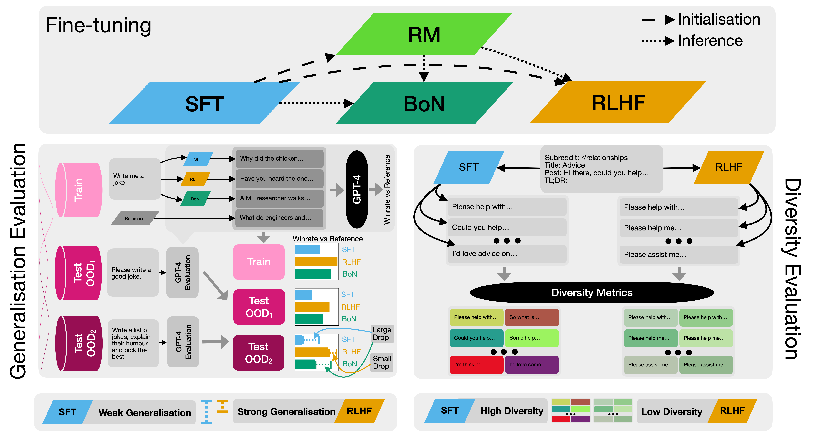

# Code for **Understanding the Effects of RLHF on LLM Generalisation and Diversity**

This is code for most of the experiments in the paper **Understanding the Effects of RLHF on LLM Generalisation and Diversity**. The paper is available at https://arxiv.org/abs/2310.06452.

For more information see the twitter thread: https://twitter.com/_robertkirk/status/1712083230965280784



### Setup

To set up, first clone this repository.

Then, install the requirements in `requirements.txt`, probably in a python virtual environment. There is also a `Dockerfile`, which may require slight adjustment but should work most of the training scripts.

For SFT: Then install deepspeed with `pip install deepspeed`, and then following instructions here https://www.deepspeed.ai/tutorials/advanced-install/ - you may need to install cuda development packages for this to work. You just need the cpu_adam op installed I think.

### Caveats

The code is tightly integrated with Weights&Biases, especially evaluation code. You can either go with this, or adapt the scripts that scrape results from W&B to use your own logging system.

All scripts are designed to be run from inside the `rlvsil` folder, so you may need to adjust paths if you run them from elsewhere.

## Running Experiments

Then try this command for SFT training:

```bash
python train_and_eval.py --dataset summarisation --num_train_epochs 1 --wandb_tags sl,summarisation,opt --generation_max_new_tokens 48 --save_steps 100 --save_total_limit 2 --eval_steps 250 --logging_steps 25 --seed 3 --do_train --do_eval --output_dir . --training_evaluation_batches 10 --validation_evaluation_batches 20 --fp16=0 --freeze_layers 0.8 --model_name huggyllama/llama-7b --per_device_train_batch_size 2 --per_device_eval_batch_size 2 --gradient_accumulation_steps 8 --learning_rate 3e-5
```

and for parallel training (you need two gpus for this).
```
deepspeed --num_gpus=2 train_and_eval.py --dataset summarisation --num_train_epochs 1 --wandb_tags sl,summarisation,opt --generation_max_new_tokens 48 --save_steps 100 --save_total_limit 2 --eval_steps 250 --logging_steps 25 --seed 3 --do_train --do_eval --output_dir . --training_evaluation_batches 10 --validation_evaluation_batches 20 --fp16=0 --freeze_layers 0.8 --model_name huggyllama/llama-7b --per_device_train_batch_size 2 --per_device_eval_batch_size 2 --gradient_accumulation_steps 8 --learning_rate 3e-5 --deepspeed ds_config_3
```

Then try this command for RM training
```
python train_summarisation_reward_model.py --wandb_tags train,rm,summarisation,llama --seed 100984844 --num_train_epochs 1 --save_steps 100 --save_total_limit 2 --eval_steps 250 --output_dir --fp16=0 --training_evaluation_batches 100 --validation_evaluation_batches 100 --model_name <path_to_sft_model> --learning_rate 1e-5 --per_device_train_batch_size 1 --per_device_eval_batch_size 1 --gradient_accumulation_steps 8 --freeze_layers 0.8
```
and for parallel training
```
deepspeed --num_gpus=2 train_summarisation_reward_model.py --wandb_tags train,rm,summarisation,llama --seed 100984844 --num_train_epochs 1 --save_steps 100 --save_total_limit 2 --eval_steps 250 --output_dir --fp16=0 --deepspeed ds_config_3.json --training_evaluation_batches 100 --validation_evaluation_batches 100 --model_name <path_to_sft_model> --learning_rate 1e-5 --per_device_train_batch_size 1 --per_device_eval_batch_size 1 --gradient_accumulation_steps 8 --freeze_layers 0.8
```
Then try this command for RL training:

```bash
accelerate launch experiment_accel.py wandb_tags=[train,rl,summarisation,accelerate] entity=ucl-dark project=rlvsil-main dataset=summarisation reward_function=summarisation freeze_layers=0.8 total_steps=500 discounting=1 ppo_epochs=4 max_new_tokens=48 adap_kl_ctrl=false kl_approx=2 checkpoint_steps=25 checkpoint_limit=2 log_steps=10 evaluation_steps=600 target_eval_datapoints=100 group=12849997-5 seed=128499975 ref_device=cuda:2 rf_device=cuda:2 policy_head_device=cuda:0 policy_split_percentage=0.8 device=cuda:1 log_level=debug model_name=UCL-DARK/sl-llama-6.7b-100ds rollout_batch_size=2 rollout_accumulation_steps=8 learn_batch_size=1 gradient_accumulation_steps=16 adam_learning_rate=1.5e-6 rf_model_dir=UCL-DARK/rm-llama-6.7b-100ds baseline_cost=0.2 init_kl_coef=5.0
```

For best-of-N sampling, use this command:

```bash
python sample_best_of_N.py --wandb_tags bon,sl,summarisation,evaluation --generation_max_new_tokens 48 --seed 43 --do_eval --output_dir . --freeze_layers 0.8 --num_return_sequences 16 --evaluation_splits test,ood_test --model_name <path_to_sft_model> --per_device_train_batch_size 4 --per_device_eval_batch_size 4 --rf_model_dir <path_to_rm>
```

For calculating diversity (from a best-of-N run), use this command:

```bash
python calculate_diversity.py --sample_overall --no_overall_input --diversity_metrics ead_averaged_distinct_ngrams,nli_sample_from_sim,sent_bert_from_sim --run_ids <bon_wandb_run_id> --table_name test
```

## Code structure

Scripts:
  - `train_and_eval.py`: SFT training script
  - `train_summarisation_reward_model.py`: RM training script
  - `experiment_accel.py`: RL training script
  - `calculate_diversity.py`: Script for calculating diversity metrics from a wandb run
  - `sample_best_of_N.py`: Script for doing best-of-N sampling

Folders:
  - `models/`: contains the model classes
  - `dataset/`: contains the dataset and collation functions
  - `utils/`: contains helper functions
  - `lab/`: contains the `Experiment` class which implements the training and evaluation loop, as well as the argument definitions
  - `altos/`: contains the PPO algorithm implementation
  - `evaluation/`: contains the evaluation metrics and matching reward functions for RL training and evaluation
  - `diversity/`: contains code for calculating diversity metrics
  - `core/`: contains utility code, mostly for RL training
  - `human_eval_scripts/`: contains scripts for creating scale batches for human evaluation, analysing those batches, and various other functionalities

## Other experiments from the paper

For the alpaca farm experiments, we mostly utilised the existing [alpaca_eval](https://github.com/tatsu-lab/alpaca_eval), but for the new datasets, we created a fork of the Alpaca codebase, which can be found here: https://github.com/RobertKirk/stanford_alpaca.


# License

The majority of `rlhf-gen-div` code is licensed under CC-BY-NC, however portions of the project are available under separate license terms: Tk-Instruct and diversity-eval are licensed under the MIT license; TRL is licensed under the Apache-2.0 license.
